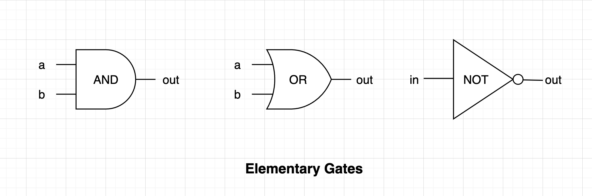
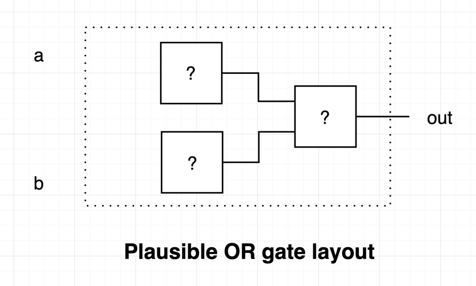

# Chapter 1 - Boolean Logic

## Boolean Functions
Elementary gates such as `AND`, `OR`, and `NOT` gates are physical implementations of _boolean functions_. A boolean
function operates on binary inputs (`1` or `0`) and returns binary outputs. A boolean function can be described in a
number of ways.

### Truth Table

A truth table is a list of all possible inputs and their respective outputs of a boolean function. Below is the truth
table for the `AND` boolean function.

| x | y | out |
|---|---|-----|
| 0 | 0 | 0   |
| 1 | 0 | 0   |
| 0 | 1 | 0   |
| 1 | 1 | 1   |

### Boolean expressions

A boolean function can also be described by using boolean operators (`AND`, `OR`, `NOT`) over its input. The `NOR`
boolean function can then be written as:

```
NOT (x OR y)
```

Mathematical symbols are also used to construct these expressions

| Operator | Symbol | Example (each line are equivalent) |
|----------|--------|------------------------------------|
| `AND`    | `*`    | `x AND y`<br/> `x * y`<br/> `xy`   | 
| `OR`     | `+`    | `x OR y` <br/> `x + y`             |
| `NOT`    | `!`    | `NOT x` <br/> `!x`                 |

Note: Adding a dash on top of the variable (ex: `x̄`)is the common symbol for `NOT`, but typing it would be very
tedious, so I decided to use the more programming-prevalent `!`  instead.

As stated in the `NAND` example, parentheses are used to group operations so it follows the usual order of operations.

### Canonical Representation

A boolean function can always be reduced to its canonical representation by `AND`-ing all the rows in its truth table
that has the value of `1`. In essence, this means that all boolean function, regardless of complexity, can be
constructed by `AND`, `OR`, and `NOT` operators.

| x | y | out |
|---|---|-----|
| 0 | 0 | 1   |
| 1 | 0 | 0   |
| 0 | 1 | 1   |
| 1 | 1 | 1   |

As an example, the boolean function described with the truth table above has three rows that has the `1` output. Its
canonical representation is the following expression:

```
(!x * !y) * (!x * y) * (xy)
```

Note: this boolean function does the _"if x then y"_ operation.

### Possible functions for two boolean inputs

There are only 16 possible combinations for two boolean inputs.


### The special property of NAND

Although not unique to `NAND`, a special property of it is that `OR`, `AND`, and `NOT` can be constructed by `NAND` operations alone. And with these operations, all possible boolean functions can be implemented. This implies that with a sufficient number of `NAND` gates, we can construct increasingly complex gates and components, allowing us to build a computer that can run programs such as Tetris. Thus, nand2tetris 🙂

## Gate Logic

The term _gate_ is already used in the prior text. To give it a definition, we can say that it is a physical implementation of a boolean function. If a boolean function operates on two variables and produces one result, then its gate implementation will work on two _inputs_ and produce one _output_.

The terms _gates_ and _chips_ are used interchangeably, with _gates_ used for the basic / elementary chips.



### Primitive and Composite Gates

A _primitive gate_ is a standalone gate that is readily available to the designer. These primitive gates can be combined to build and satisfy the specifications of a more complex composite gate.


### Hardware Description Language

In order to build out the chips in this project, a Hardware Simulator that can read and run programs written in a Hardware Description Language (HDL) is supplied by the authors. Combined with the provided test scripts, this allows test-driven implementation of the chips required.


## Project

### NAND

`NAND` is considered a primitive, in which the basis of the whole course is that all other gates will be implemented from it.

### NOT

At first, I thought there's only so many combinations we can do with `NAND` gates that it's hard not to stumble for the implementation of [`NOT`](./Not.hdl). But it's much simpler than that -- since `NOT` only accepts one input, it means we can ignore half of `NAND`s truth table (the 0/1 and 1/0) and see that passing the input into both `NAND`'s input pins achieve the same effect.


### AND

Logically, if `NAND` is negated [`AND`](./And.hdl), we could just negate it again to get it back, right?


### OR

There doesn't seem to be an obvious connection to the behavior of [`OR`](./Or.hdl) with our existing gates so far. My first thought is to `NOT` one of the input pins and pass the other to either `NAND` or `AND`. But this would fail as 1/0 and 0/1 will always yield different results.

Negating the inputs and passing it to `AND` is the same as using a `NAND`. Negating the output of `AND` is also the same as a `NAND`. This reduces the combinations we need to think regarding `NOT` and `AND` gates.

`NAND` and `OR` has the same results for 1/0 and 0/1. `AND` and `OR` has the same results for 0/0 and 1/1. I unfortunately was not able to get anywhere with this idea, as it requires the use of `NOT` in conjunction with `AND` to get anything meaningful.

In the end, I took the approach of picking a plausible gate layout and working my way backwards from the `OR`'s truth table.



Given that I already ruled out any usage of `AND` + `NOT`, I just plugged in `NAND` gates and realized that a three of them will do the job.


Side note: this is the first time I solved `OR` without brute-forcing its canonical representation. Yay! 🥳

### XOR

The [`XOR`](./Xor.hdl) gate obviously will use an `OR` gate. Perhaps passing its input to another gate will do the job?

**Hindsight:** No, it was not that simple.

A `NAND` gate will be crucial here as it is the only one that results in 0 for 1/1.

My theory is that if the gate has two inputs, and we're trying out two gates in the front, they have to be identical
gates. Otherwise, it wouldn't make sense for 1/0 and 0/1.

After playing around with the two chip in the front layout, I noticed that I'm always getting unique combinations. There
has to be a duplicate as 0/0 and 1/1 are the same in `XOR`.

**Hindsight**: I'm correct here, and we'll have to negate one of the inputs to get a differing result.

`OR`-ing each input separately is essentially a noop.

After about an hour, I realized that I'm overthinking this. I can imagine this should be 3-4 gates max.

**Hindsight**: Yes, I was too caught up with the similarities of `XOR` to `OR` when it should've been obvious that
there's no quick way to match their truth tables with the gates we have so far.

The key is to negate one of the inputs. Picking the next gate to use can be done randomly -- I happened to pick `OR`.
Having seen the result of `a + !b` is the same for 0/0 and 1/1, I just need to find a pair for each result that I can
`AND` or `NAND` to get the `XOR` value.

| a | b | `a + !b` | `NAND` to get `XOR` value | Expected `XOR` |
|---|---|----------|---------------------------|----------------| 
| 0 | 0 | 1        | 1                         | 0              |
| 0 | 1 | 0        | 1                         | 1              | 
| 1 | 0 | 1        | 0                         | 1              | 
| 1 | 1 | 1        | 1                         | 0              |

I arrived at the following layout, which I'm also quite proud of as I haven't implemented `XOR` beforehand without
relying on its canonical representation 🥳


### Multiplexor (MUX)

[`MUX`](./Mux.hdl) is the first chip with more than 2 inputs. My first thought is to feed `a` and `b` to an existing gate, and then feed the result in conjunction with `sel` to another gate. 

**Hindsight**: This is an incorrect way of thinking through this problem, but would be beneficial when I tackle multi-way gates.

I'll try to find a way to do `if x then y` first. This allows me to say `if sel then a` as well as `if !sel then b`. I then almost instantly figured out that's what an `AND` gate does.

Testing my `AND` theory quickly reveals that I misunderstood the spec -- `sel` pertains to the index, thus it should be `if !sel then a` as `a` is the zeroth input.

Figuring out what to do with either inputs is just a matter of running through the truth table and picking a suitable gate, in which `OR` fits the bill.


### Demultiplexor (DMUX)

[`DMUX`](./DMux.hdl) on the other hand is the first chip with more than one output.

At first glance I can see that half of the work is just utilizing the `if x then y` pattern from `MUX`. 

**Hindsight**: It's not half the problem, that's pretty much it.


### 16-bit version of basic gates

Not a lot to say here. Implementing [`NOT16`](./Not16.hdl), [`AND16`](./And16.hdl), [`OR16`](./Or16.hdl), and [`MUX16`](./Mux16.hdl) is just a matter of lining up 16 pieces of the relevant single-bit gate/chip and feeding each input to the output.


