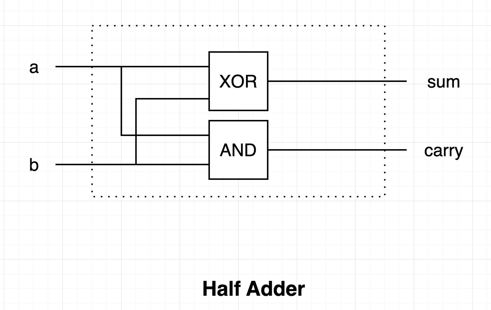
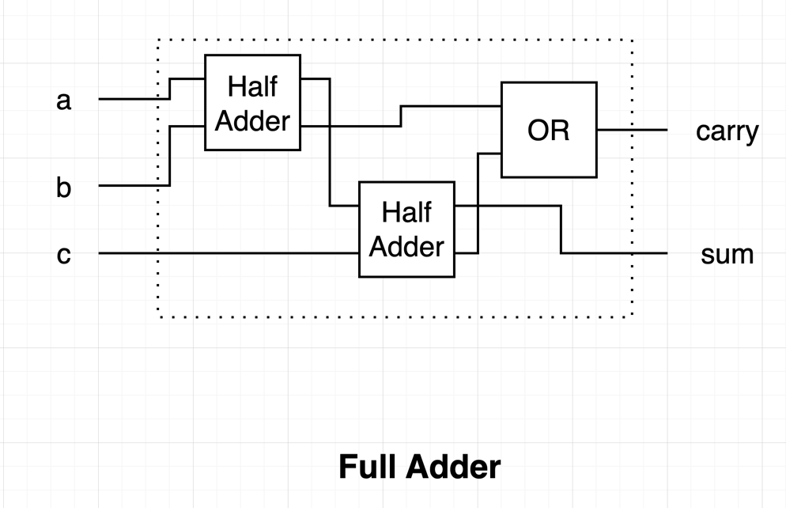
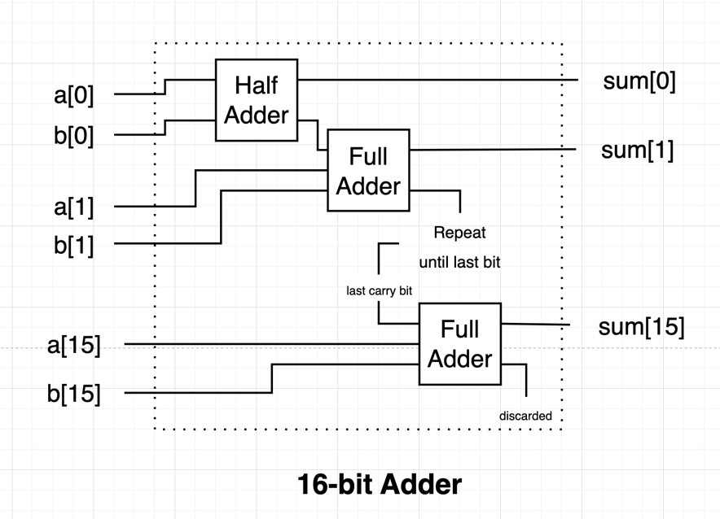
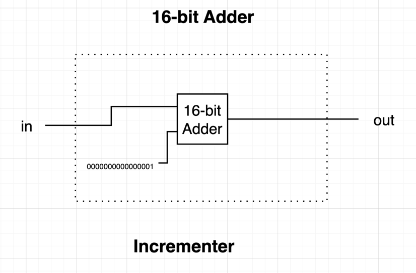

# Chapter 2 - Boolean Arithmetic

### Binary Addition

Binary numbers are added in the same way as decimal numbers -- from least significant to the most significant number (right to left). Carry overs are added to the next significant number (to the right).

```
     1 1
   1 0 1 1
+  0 0 1 1
----------
   1 1 1 0
```

Seen above is that `1 + 1 = 0` with a carry over of `1`, and `1 + 1 + 1 = 1` with a carry over of `1`.

### Signed Binary Numbers

If a computer system is to support both negative and positive numbers, it needs a way to encode both. _2's complement_ is one widely adopted encoding that allocates half of the available binary patterns to either side. It is named as such because adding the binary digit for a positive and negative number will always result to `n^2`. 

For example, in a 4-bit system:

```
0 0 1 1 -> 3
? ? ? ? -> What would be the encoding for -3?
1 1 0 1 -> Since 4^2 =16, we know that it should be 16-3=13
```

Another way of looking at the conversion is to flip all the bits of `x` and add `1` to get `-x`:

```
0 1 0 1 -> 5
1 0 1 0 -> flipped
1 0 1 1 -> added 1, we get -5
        -> This also represents 11, which is correct as 5 + 11 = 16
```

Inversely, we can  deduct a `1`, and then flip all bits and to go from `-x` to `x`

```
1 0 1 0 -> -6
1 0 0 1 -> subtracted 1
0 1 1 0 -> flipped, we get 6
```

Adding any binary number will also yield the correct decimal number, considering positive/negative:

```
      1
  1 0 0 1 -> -7
+ 0 0 0 1 ->  1
---------
  1 0 1 0 ->  6
```

A nice feature of 2's complement is that the most significant bit asserts whether the number is positive (0) or negative (1).

## Project

### Half-Adder

Looking at the [Half Adder](./HalfAdder.hdl)'s truth table, it's easy to spot that `carry` can be achieved by `AND`. The `sum` on the other hand can be computed by an `XOR`.



### Full-Adder

Perhaps [Full Adder](./FullAdder.hdl) is as simple as connecting two half-adders?

**Hindsight**: Not quite. Since we're getting two `carry`s, we need to `OR` them to get the actual final `carry` result.




### 16-bit Adder

I'm pretty certain that [adding 16 bits](./Add16.hdl) is just a matter of feeding all the bits to an array of full-adders and discarding the last carry.



### Incrementer

An [incrementer](./Inc16.hdl) should just be the input fed to an adder with the other pin fed a hardcoded `1` on the
least significant bit.

**Hindsight**: The tricky part is the HDL syntax for doing hardcoded inputs.

```
// It should be noted that we can start by setting b=false, which gives it a value of 0000000000000000.
// Setting b[0]=true then asserts the least significant bit, giving us 0000000000000001.
Add16(a=in, b=false, b[0]=true, out=out);
```



