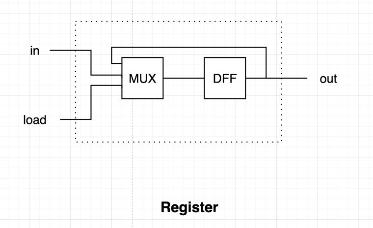
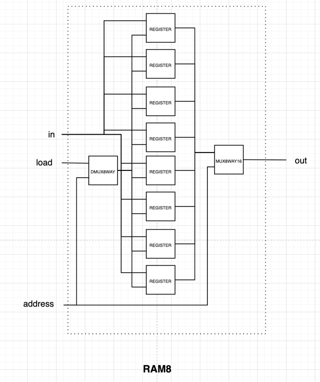

# Chapter 3 - Sequential Logic

The chips from the previous sections are _combinational_, in which computational functions are provided by the chips. _Sequential_ chips provide state or memory, allowing us to store data.

In order for a chip to be able to store data, we need to have a concept of a _clock_. We can think of a master clock that alternates between 0/1 and sends that signal through all sequential chips in the system. These 0/1 pairs can be thought of as a _tick_ and a _tock_, and a pair is considered as a unit of time cycle.

### Data Flip Flops

A Data Flip-Flop (`DFF`) is a chip that emits the input from the last time unit (`out(t) = in(t - 1)`). They are the backbone of the sequential chips built in this chapter.

### Registers

Registers, on the other hand, emits the _output_ from the last time unit (`out(t) = out(t - 1)`). This means that they are capable of remembering state, and not just echoing what it received as input. Registers are implemented by feeding a `DFF`'s output back to itself, using a `MUX` and a `load` bit to determine if it should store its prior output or load the current `in` value.

### Terminologies regarding memories

- Register: A device that can remember prior state and can be loaded by new state.
- Bit: A register for a single binary value.
- Word: An array of registers, usually defined by its length.

### Random Access Memory (RAM)

A `RAM` is a device that contains an array of registers and access logic that allows for random access to its content. Each register is assigned a logical address, in which it can be either written to or read from depending on the `load` parameter.

### Counter

Counters are chips that emits incremental values, and often comes with reset (to zero) or load functionalities. They are generally used as _program counters_, wherein they track which command is next to be executed.

### How time matters in the overall architecture

We can imagine that an `ALU` is provided inputs from a nearby register and one that is physically farther away. Given that an `ALU` is combinational, it has no concept of time, and it will happily calculate whatever is given to it. 

How can we overcome this problem? Given that the `ALU`'s output will be stored in another sequential chip (`RAM` or a register location), then as long as the clock cycle is slightly longer than the time it takes for a bit to travel between the two farthest chip locations in the architecture, then the `ALU`'s output will always be synchronized by the end of each time unit.

## Project

### Bit

As shown in the [registers section](#registers), a [`BIT`](./a/Bit.hdl) can be implemented using a `DFF` and a `MUX`.

### Register

A [Register](./a/Register.hdl) is just an array of 16 `BIT`s.

### RAM8

A [`RAM8`](./a/RAM8.hdl) is 8 registers lined up, with logic to select a register using the `address` input. This could
be done using an `MUX8WAY16`.

**Hindsight**: The above implements the RAM's output, but not how the RAM stores the data. This part can be done using
an `DMUX8WAY` on the `load` and `address` input.

