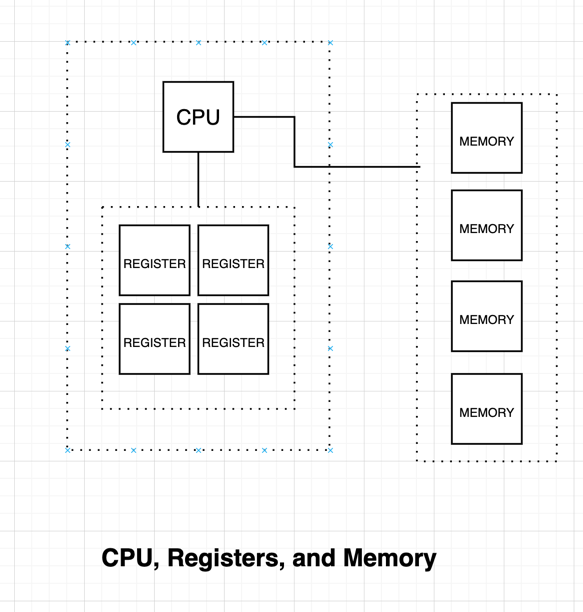

# Chapter 4 - Machine Language

A computer system's machine language is a formalism that is used to code low-level programs that executes on the
underlying hardware.



In terms of what the machine language does, it works on the `CPU`, a set of Registers, and Memory. A `CPU` fetches and
stores instructions and/or data into the Memory. For faster access to data, a set of registers are in the `CPU`'s
proximity.

### Language

**Note**: the language described in the following sections is a generic representation of what machine and assembly language looks like. Notes about the actual _Hack_ machine language is further down below.

A machine language is a readable translation of a computer instruction. On a 16-bit computer, an instruction could read
like:

```
1010001100011001
```

This could be read as four 4-bit pairs, each specifying a particular part of an instruction:

```
1010 Specifies that this is an addition instruction.
0011 Specifies that the result will be saved to Register 3
0001 Specifies the first operand is the value at Register 1
1001 and the second is at Register 9
```

The symbolic mnemonics of the language might produce the following machine language instruction:

```
ADD R3, R1, R9
```

These instructions can be fed to an _assembler_ program which will translate it back to its binary form.

### Commands

- Arithmetic and logic operations:

```
ADD R2, R1, R3   // R2 <- R1+R3
ADD R2, R1, foo  // R2 <- R1+foo (user-defined address)
AND R1, R1, R2   // R1 <- R1&R2
```

- Direct memory access:

```
LOAD R1, 67  // R1 <- M[67]
LOAD R1, bar // R1 <- M[67], assuming bar=67
```

- Immediate addressing:

```
LOADI R1, 67 // R1 <- 67 (constant value)
```

- Indirect addressing (pointers):

``` 
// x=foo[j]
ADD R1, foo, j // R1 <- foo + j (or foo[j])
LOAD* R2, R1   // R2 <- M[R1]
STR R2, x      // x <- R2
```

- Flow control (jumps)

The code block below written in C:

```c
while (R1 >= 0) {
    // code segment 1
}
// code segment 2
```

... is loosely translated to this assembly code:

```
while:
    JNG R1, endWhile
    // code segment 1
    JMP while
endWhile:
    // code segment 2
```
