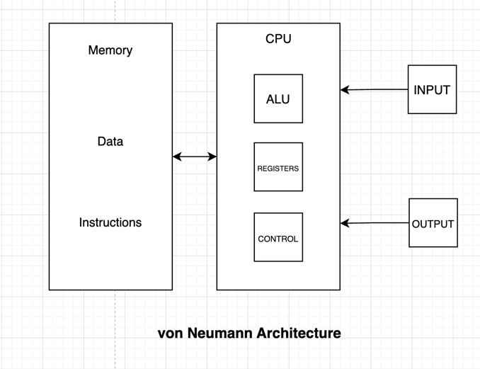
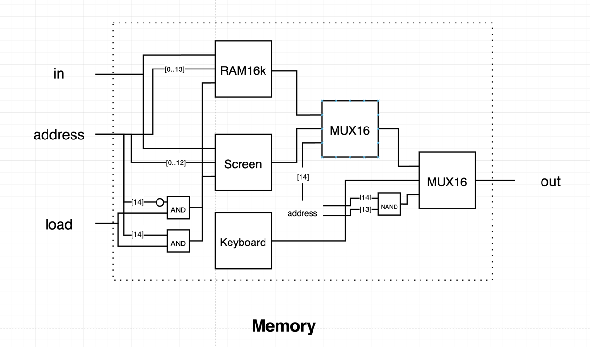

# Chapter 5 - Computer Architecture

## Stored Programs

Computers, unlike other machines, are programmed and executed with what's called as _stored programs_. This difference allows computers to execute arbitrary _software_, unlike single-purpose machines that can only do one specific function.

## von Neumann Architecture

The von Neumann architecture is based on a CPU receiving input and producing output, while interacting with a memory device. The memory not only stores data, but also the instructions that tell the computer what to do.

## Control Unit

The control unit decodes a given instruction and signals various devices (ALU, registers, memory) how to execute the instruction.

## Registers

Memory access is slow as it requires travelling to and from a memory device. CPUs are equipped with registers inside them, making data access faster as they're only a few registers available (thus smaller address sizes) and they're physically located near the control unit.

There are three common register types:

1. Data register: Used to store data for the CPU
2. Address register: Used to store the address for subsequent instructions to work on
3. Program counter: Holds reference to which instruction to execute next. Typically incremented after each instruction, while also offering a `load` mechanism so it can execute jumps.

## Input / Output

Input and output are done by manipulating bits on a _memory map_. For inputs, the memory map defines the physical state (a keypress writes the key code on memory). For output, the memory map drives the output device (a pixels is blackened by writing `1`, in which the device polls the memory map).

## Project

### Memory

The `Memory` device is an abstraction for the Screen, Keyboard, and a 16k memory space.

**Hindsight**: The chip selection is pretty straightforward. But properly using bus indices is what caught me by
surprise -- the MSB (most significant bit) is indexed at `bus[len - 1]`, not `0`.

